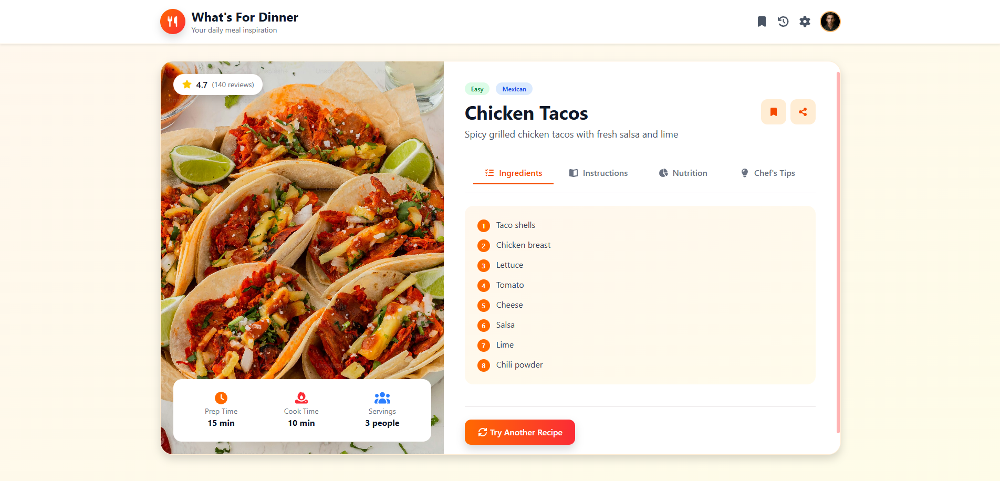

# 📋 What's For Dinner Web Application

A responsive web app that generates random meal ideas to help users quickly decide what to eat, with a simple and interactive UI.

---

## 🚀 Features

- **Random Meal Generator:** Instantly generates random meal ideas to help users decide what to eat easily.
- **Responsive Design:** Fully responsive layout built with **Bootstrap 5**, ensuring smooth experience across all devices.
- **Modern UI:** Clean and modern interface for easy interaction and fast usage.
- **Fast Performance:** Lightweight app with quick response and smooth user experience.

## 🛠️ Tech Stack

- **Frontend:** HTML5, CSS3, Bootstrap 5
- **Logic:** JavaScript
- **Icons:** FontAwesome 6

## Screenshots

  

